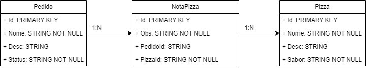
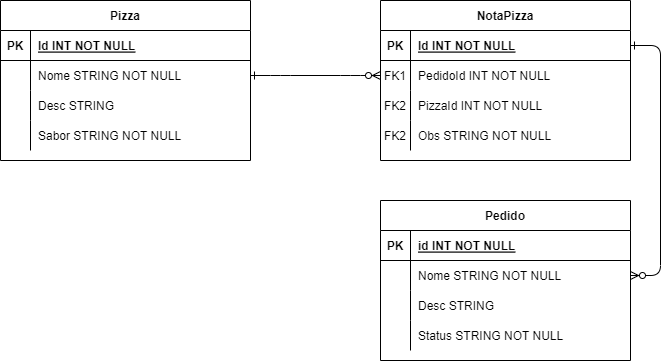
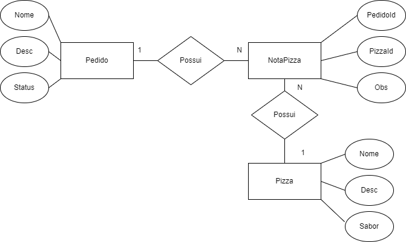

# GLAPP 
# Tema: Pizzaria.
> BY: GUILHERME & LUAN

> Link da API: https://viacep.com.br/

> Funcionalidades: O aplicativo terá como objetivo mostrar ao usuário, através de uma interface minimalista e acessível, o local que ele pesquisar através do CEP. Assim, ele poderá fazer um pedido de uma pizza,sendo elas disponíveis nos sabores que será inserido na área do Pizzaiolo.
# Diagramas:

  

  
  

  

 
<b>Contador de Visitas</b>
  

 
 

