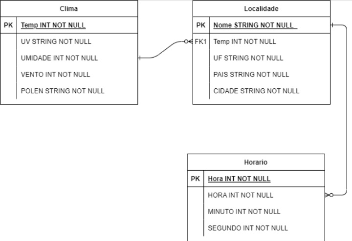
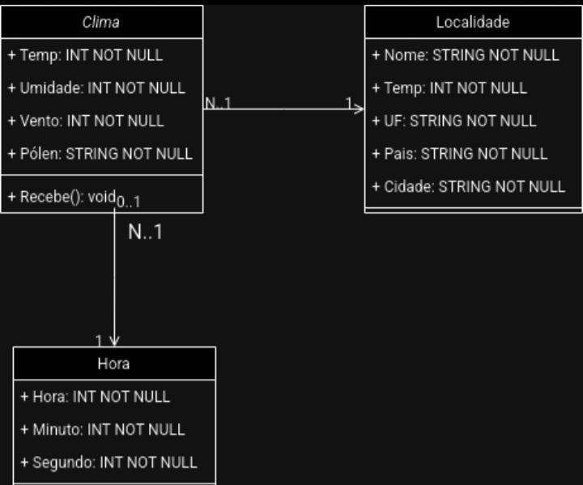
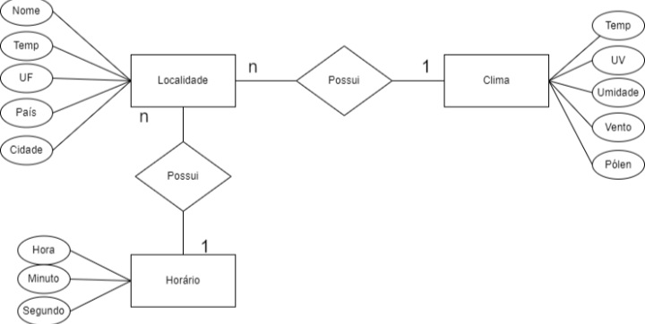

# GLAPP 
# Tema: Previsão do tempo.
> BY: GUILHERME & LUAN

> Link da API: https://viacep.com.br/

> Funcionalidades: O aplicativo terá como objetivo mostrar ao usuário, através de uma interface minimalista e acessível, o clima do local que ele pesquisar através do CEP. Além de mostrar o clima, será informado também os índices de raios Ultravioletas, nível de pólen, entre outras funcionalidades extras.
# Diagramas:

  

  
  ⠀⠀⠀⠀⠀⠀⠀⠀⠀⠀⠀⠀⠀⠀
  

 
<b>Contador de Visitas</b>
  

 
 

